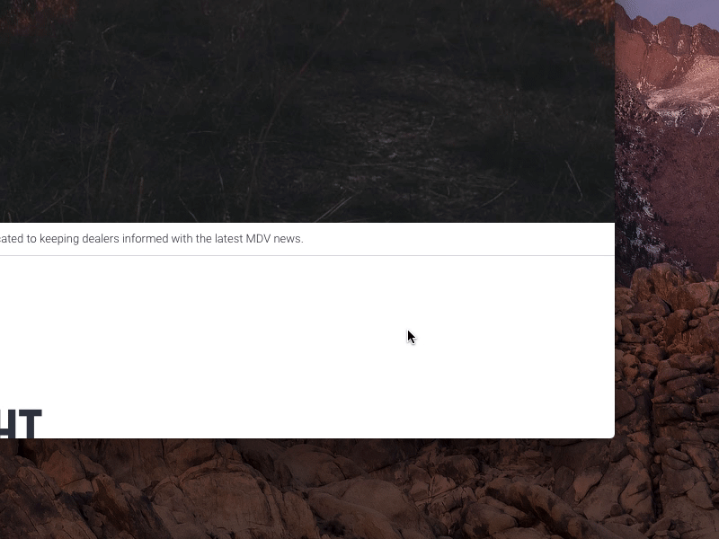

##Custom Parallax

This parallax header was built from scratch partly because I wanted to learn, partly because I had a very specific look I was hoping to accomplish. I spent a lot of time learning about optimizing performance as this technique can be "heavy" if not done with care.

## Back-to-top interaction

### My experience using Parcel - Things to remember:

Svgo was stripping the viewBox attribute out of my SVGs during the "build for production" process. Adding the **.posthtmlrc** gave some parameters which solved this issue.

When running build for production, The file names Parcel was giving to my css and js files didn't match what was linked in index.html. Solution was to add "--public-url ./" to my build script in package.json.

Having an underscore on my project entrypoint, index.html, caused issues when trying to use browsersync. I removed the underscore even though it hurts my OCD.

